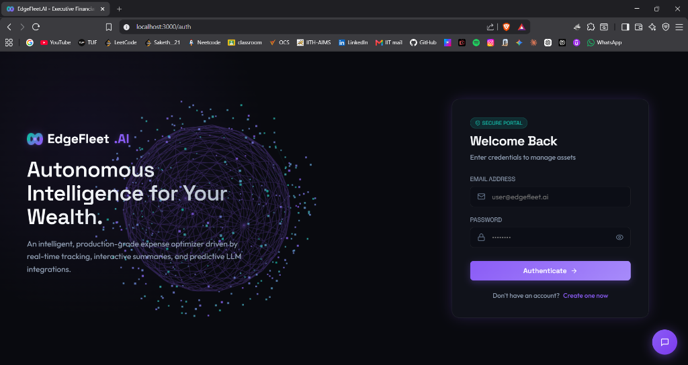
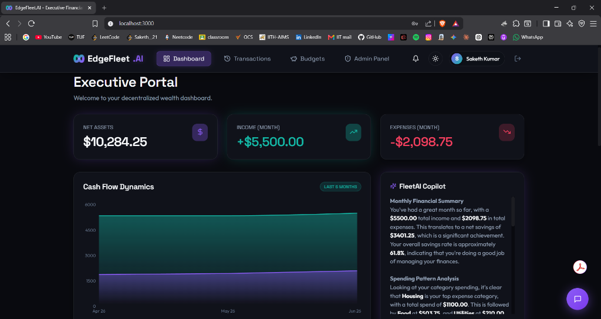
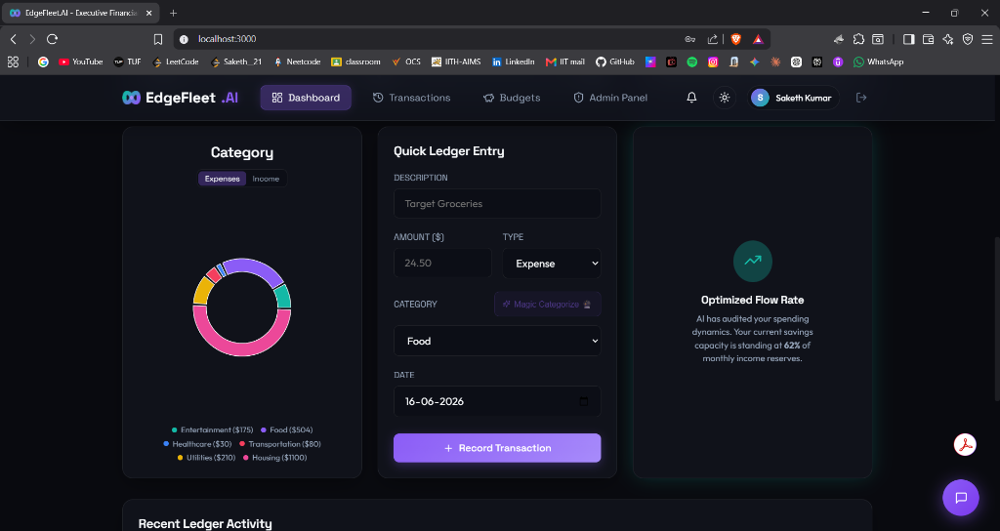
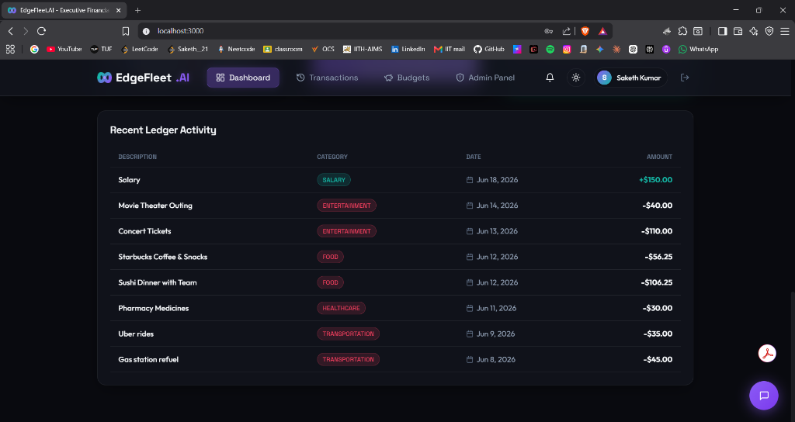
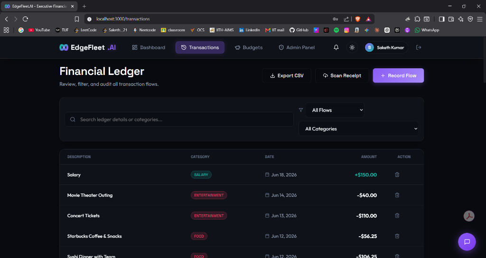
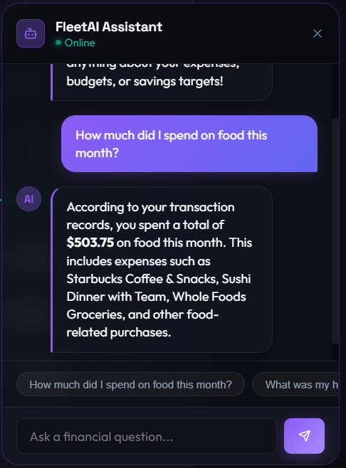
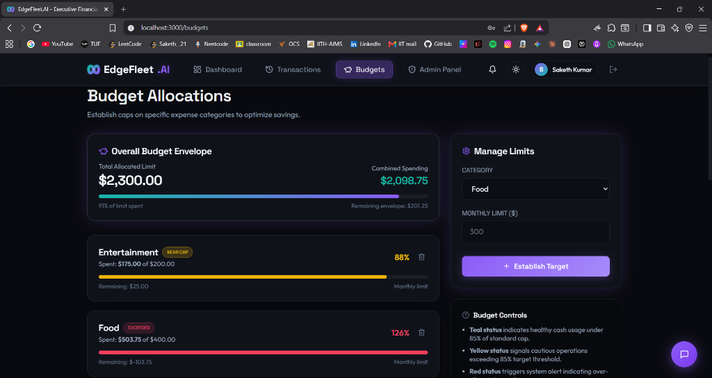
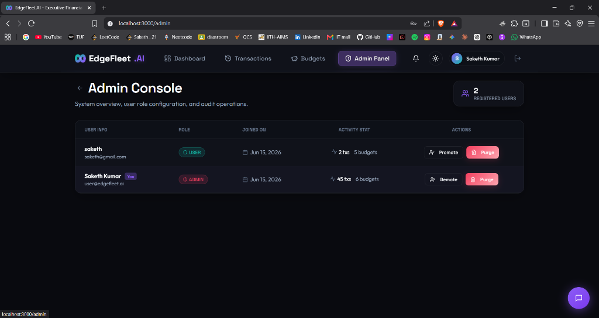

# EdgeFleet.AI - AI-Powered Finance & Expense Tracking Platform

A modern, full-stack executive wealth management portal designed to help users record transactions, establish monthly budget ceilings, monitor cash flow trends, and get smart financial recommendations. 

Featuring an interactive 3D landing canvas, GSAP-driven transitions, and a conversational AI Financial Assistant Copilot.

---

## 🌐 Live Production Link

The application is deployed and available online:
👉 **[https://edge-fleet-ai-4yv8.vercel.app/](https://edge-fleet-ai-4yv8.vercel.app/)**

---

## 🚀 Key Features

1. **Futuristic 3D WebGL Hero Canvas**: Interactive rotating digital network nodes on the landing page, responding smoothly to cursor coordinates.
2. **Glassmorphic Obsidian Theme**: Tailored HSL color design system with Neon Violet/Teal accents, glass-blur backdrops, and active menu indicators.
3. **AI Monthly Insights Summary**: Automatically aggregates transaction records, checks budget targets, sorts highest spending categories, and compiles descriptive monthly summaries with cost-saving recommendations.
4. **Conversational Financial Copilot (AI Chatbot)**: Floating chat assistant that queries active database records to answer user prompts (e.g. *"How much did I spend on Food?"* or *"My highest expense?"*).
5. **AI OCR Receipt Preset Scanner**: Drop-zone image scanner enabling preset uploads that send base64 files to the AI parser, automatically extracting description, category, and amount parameters.
6. **Smart Budget Alert Meters**: Category progress bars shifting colors dynamically (**Teal** -> **Yellow** -> **Red**) depending on spending thresholds, showing exact remaining limits.
7. **CSV Exporter**: Expose ledger records into standardized downloadable CSV tables.
8. **Prisma ORM & SQLite Database**: Structured relational schemas running zero-setup local storage with database-level performance indexes, fully interchangeable with PostgreSQL/MongoDB.

---

## 🛠️ Technology Stack

* **Frontend**: React (Vite), TypeScript, GSAP Animations, Three.js (WebGL), Recharts, Lucide Icons.
* **Backend**: Node.js, Express, TypeScript, Prisma ORM, Helmet Security, Express Rate Limiter, Morgan logger.
* **Database**: SQLite (local dev database).
* **AI Provider**: Groq LPU API (`llama-3.3-70b-versatile`, primary) with Google Gemini API (`gemini-2.5-flash`, secondary) and a local rule-based smart engine (tertiary) fallback if API keys are absent.

---

## 📁 Folder Structure

```text
EdgeFleetAI/
├── backend/                  # Express TypeScript Backend
│   ├── prisma/               # Schema and Database seeding
│   │   ├── schema.prisma     # SQLite model blueprints
│   │   └── seed.ts           # Populates 3 months of test transactions
│   ├── src/
│   │   ├── controllers/      # Route logic handlers (auth, transaction, budget, ai)
│   │   ├── middleware/       # JWT Token verify & Rate limiter
│   │   ├── routes/           # Routing registers
│   │   ├── services/         # Gemini AI and DB instantiation
│   │   └── index.ts          # Main Express app bootstrap
│   └── package.json
├── frontend/                 # React Vite TypeScript Frontend
│   ├── src/
│   │   ├── components/       # HeroCanvas, Chatbot assistant, GlassCard panels
│   │   ├── context/          # Auth Context and Theme Context (Dark/Light mode)
│   │   ├── hooks/            # useApi request wrapper
│   │   ├── pages/            # Dashboard page, Transactions ledger, Budgets capping
│   │   ├── styles/           # CSS Variables design tokens
│   │   └── App.tsx           # Page routing and layout
│   └── package.json
└── README.md
```

---

## ⚙️ Local Setup Instructions

### Prerequisites
* Node.js (v18 or higher recommended)
* npm (v9 or higher)

### 1. Database Setup & Migration (Backend)
Navigate to the `backend/` directory:
```bash
cd backend
```
Install dependencies:
```bash
npm install
```
Configure your environment. Copy `.env.example` to `.env` (it contains default local setups):
```bash
cp .env.example .env
```
*(Optional) If you have a Google Gemini API Key, insert it into `GEMINI_API_KEY` in the `.env` file to activate the Gemini LLM. Otherwise, the platform executes a dynamic fallback rule-engine that answers queries based on real SQLite data.*

Generate Prisma clients and execute migrations:
```bash
npx prisma migrate dev --name init
```
Seed the database with default test accounts, category budget limits, and 3 months of transaction histories:
```bash
npm run db:seed
```
*Note: Seeding creates a default user `user@edgefleet.ai` with password `Pass@1234`.*

Start the backend API server:
```bash
npm run dev
```
The server starts listening on: **http://localhost:5000**.

---

### 2. Frontend Launch
Open a new terminal window and navigate to the `frontend/` directory:
```bash
cd frontend
```
Install dependencies:
```bash
npm install
```
Start the local development server:
```bash
npm run dev
```
Open **http://localhost:3000** in your browser.

---

## 📈 Database Schema Explanation

Prisma models defined in `backend/prisma/schema.prisma`:

* **`User`**: Tracks name, email (unique), hashed password, and role. Possesses one-to-many relationships with `Transaction` and `Budget`.
* **`Transaction`**: Tracks `description`, `amount`, `type` (`INCOME` or `EXPENSE`), `category`, and `date`. Features composite indexing on:
  * `[userId]` (for list performance).
  * `[userId, category]` (for categoric aggregation).
  * `[userId, date]` (for period searches).
* **`Budget`**: Tracks expense capping targets per category. Features a compound index `@@unique([userId, category])` guaranteeing a user has at most one active target limit per category, preventing schema duplication during updates.

---

## 🌐 API Structure & Routes

All routes are mounted under `/api` and require an `Authorization: Bearer <jwt_token>` header, except public authentication routes:

### Authentication
| Method | Endpoint | Access | Description |
| :--- | :--- | :--- | :--- |
| **POST** | `/api/auth/register` | Public | Registers user and creates default budget slots. |
| **POST** | `/api/auth/login` | Public | Validates user and issues JWT session tokens. |
| **GET** | `/api/auth/me` | Protected | Returns validated user profiles. |

### Transactions Ledger
| Method | Endpoint | Access | Description |
| :--- | :--- | :--- | :--- |
| **GET** | `/api/transactions` | Protected | Fetches user transactions with search, category, type, and date filters. |
| **POST** | `/api/transactions` | Protected | Creates new financial record. |
| **PUT** | `/api/transactions/:id` | Protected | Edits existing transaction attributes. |
| **DELETE** | `/api/transactions/:id` | Protected | Removes transaction from ledger. |
| **POST** | `/api/transactions/parse-receipt` | Protected | Processes base64 receipt files via AI OCR parameters. |

### Budgets Targets
| Method | Endpoint | Access | Description |
| :--- | :--- | :--- | :--- |
| **GET** | `/api/budgets` | Protected | Returns active category budget lists. |
| **POST** | `/api/budgets` | Protected | Upserts limit caps for specific categories. |
| **DELETE** | `/api/budgets/:id` | Protected | Removes budget capping targets. |

### AI Assistance
| Method | Endpoint | Access | Description |
| :--- | :--- | :--- | :--- |
| **GET** | `/api/ai/summary` | Protected | Analyzes active months to compile markdown summaries. |
| **POST** | `/api/ai/chat` | Protected | Submits prompts and conversation histories to the AI Assistant. |
| **POST** | `/api/ai/categorize` | Protected | Analyzes a transaction description to auto-suggest its category. |

---

## 🖼️ Application Gallery & Walkthrough

Here is a visual tour of the platform features:

### 1. Futuristic 3D WebGL Landing & Authentication Portal
A high-performance particle system built using Three.js renders floating, interactive nodes behind an elegant glassmorphic authentication module.


### 2. Executive Analytics Dashboard & AI Insights
Features responsive glowing gradient charts representing net cash flow alongside an on-the-fly generated AI monthly summary with spending analysis.


### 3. Dynamic Category Analysis & Quick Ledger Entry
Includes dynamic categorization donut charts and instant transaction logging fields.


### 4. Live Ledger Activity logs
Displays the list of recent transactions with visual badge tags and pagination.


### 5. Detailed Financial Ledger & CSV/OCR Tools
Full ledger controls featuring sorting, filtering, one-click CSV table exports, and an AI OCR preset receipt analyzer.


### 6. Conversational AI Assistant Copilot
An integrated floating chatbot widget capable of parsing natural language prompts and querying direct relational database histories to calculate spending distributions on demand.


### 7. Interactive Category Budgets & Alert Meters
Includes customized limits per category, displaying dynamic, reactive status bars changing from **Teal** to **Yellow** to **Red** as transactions approach limits.


### 8. Role-Based Admin Management Console
A restricted console for administrators to supervise all registered user statistics, elevate/demote accounts, and execute secure database cascading purges.

