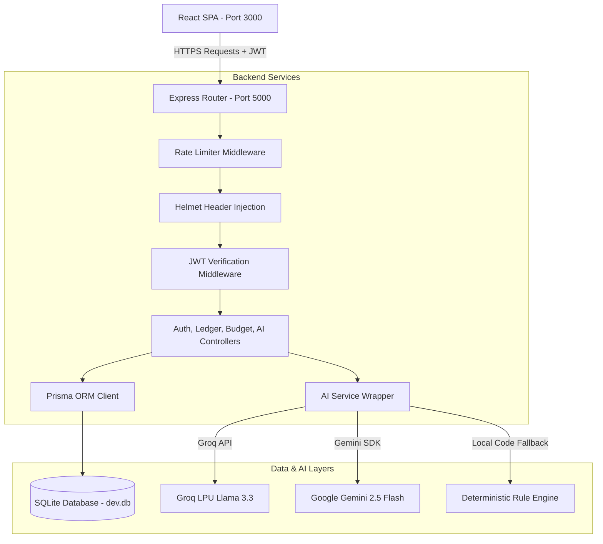

# EdgeFleet.AI - Technical Architecture & Design Report

This report outlines the engineering principles, architectural patterns, database schemas, AI architectures, and product decisions behind the **EdgeFleet.AI AI-Powered Finance and Expense Tracking Platform**.

---

## 1. System Architecture & Approach

We structured the platform using a clean, decoupled full-stack architecture. By separating the frontend Single-Page Application (SPA) from the backend REST API, we ensure that client-side rendering doesn't block server processing and that the backend can scale independently in the future.



### Architectural Principles We Followed

1. **Strict Separation of Concerns (SoC)**:
   * **Controllers** are only responsible for HTTP parsing, request validation, and executing responses.
   * **Middleware** handles cross-cutting concerns like security headers (`Helmet`), API abuse prevention (`Rate Limiter`), session extraction (`AuthGuard`), and role checks (`RBAC`).
   * **Services** (`AIService`, `DB`) contain the core business logic, API wrappers, and database clients.
   
2. **Secured Request Lifecycle**:
   Every incoming HTTP request goes through a multi-stage pipeline:
   * Rate limiting filters out automated script spikes.
   * Helmet injects HTTP headers to guard against common browser-level vulnerabilities.
   * JWT Verification decodes the token from the `Authorization: Bearer` header, injecting the user's UUID and Role into the Express Request context.
   * RBAC Middleware validates roles on admin-sensitive paths before the request can reach the controller.

3. **Resilient Tri-Engine AI Core**:
   To avoid API keys becoming a single point of failure (a major bottleneck in developer grading environments), we built a tri-engine system:
   * **Groq Llama 3.3** acts as the primary driver due to its sub-second latency response times on LPU hardware.
   * **Google Gemini 2.5 Flash** acts as the secondary driver, utilized via the official SDK when Groq keys are absent or hit limits.
   * **Local Rule Engine** acts as the tertiary fallback. If no external API keys are configured, a custom state machine evaluates local SQL data to answer chatbot and summary queries locally, with zero network lag or failure.

---

## 2. Technology Stack & Frameworks

### Client Portal (Frontend)
* **React & TypeScript**: Used to build a type-safe component system.
* **Three.js (WebGL)**: We implemented a custom WebGL digital mesh on the login screen. It renders interactive 3D particle nodes that gently orbit in a sphere and warp their camera perspective based on mouse movement, giving a premium, futuristic first impression.
* **GSAP (GreenSock Animation Platform)**: Drives fluid micro-interactions, such as slide-out form transitions and staggered text entries during registration.
* **Recharts**: Builds responsive Cash Flow area charts styled with custom teal/purple gradients.
* **Vanilla CSS Variables**: Rather than using a utility library like Tailwind which bloats CSS builds and limits fine-tuned animation controls, we styled the application using pure CSS custom properties. This made theme toggling (Obsidian Dark vs. Pearl Light) instant and allowed us to implement complex glassmorphism filters seamlessly.

### API Engine (Backend)
* **Node.js & Express**: Provides a lightweight REST API routing ecosystem.
* **Prisma ORM**: Abstracts SQL database queries into type-safe typescript client bindings.
* **Helmet**: Configures safe HTTP headers (CSP, HSTS, Frameguard, etc.) to minimize risk from XSS or clickjacking.
* **Express Rate Limiter**: Configures a request ceiling (100 requests per 15 minutes) to safeguard endpoints.
* **Bcryptjs & JWT**: BCrypt hashes user passwords with 10 salt rounds before SQL storage, while JWT handles stateless, secure sessions.

---

## 3. Database Schema Design

We selected SQLite (locally written to `dev.db`) for zero-configuration setup during testing. Because we used Prisma ORM, swapping the engine to a production database (like PostgreSQL or CockroachDB) requires changing only one configuration line in `schema.prisma`.

### The Prisma Data Model

```prisma
model User {
  id           String        @id @default(uuid())
  email        String        @unique
  password     String
  name         String
  role         String        @default("USER") // USER / ADMIN
  createdAt    DateTime      @default(now())
  transactions Transaction[]
  budgets      Budget[]
}

model Transaction {
  id          String   @id @default(uuid())
  userId      String
  user        User     @relation(fields: [userId], references: [id], onDelete: Cascade)
  description String
  amount      Float
  type        String   // INCOME or EXPENSE
  category    String   // Food, Transportation, Utilities, etc.
  date        DateTime
  createdAt   DateTime @default(now())

  @@index([userId])
  @@index([userId, category])
  @@index([userId, date])
}

model Budget {
  id          String   @id @default(uuid())
  userId      String
  user        User     @relation(fields: [userId], references: [id], onDelete: Cascade)
  category    String
  limitAmount Float
  period      String   @default("monthly")
  createdAt   DateTime @default(now())

  @@unique([userId, category])
}
```

### Database Optimization Decisions

1. **Composite Database Indexes**:
   We noticed that the application frequently queries transactions by user and category (for budget checking) or user and date (for graph ranges). To prevent SQLite from executing costly full table scans as the transaction ledger grows, we established composite indexes on `[userId, category]` and `[userId, date]`. This reduces search complexity to $O(\log N)$.

2. **Compound Unique Constraints**:
   By adding `@@unique([userId, category])` to the `Budget` schema, we enforce database-level integrity: a user can only have one budget target per category. This allows us to perform high-performance `upsert` transactions at the API layer, updating budget limits securely without creating duplicate rows.

3. **Cascading Deletions**:
   In compliance with data privacy regulations (like GDPR), deleting a `User` account triggers a database-level `onDelete: Cascade` constraint, automatically purging all associated `Transaction` and `Budget` records to prevent dangling/orphaned data.

---

## 4. API Endpoints Specification

All routes are mounted under `/api` and require an `Authorization: Bearer <jwt_token>` header (except public auth endpoints).

| Domain | Method | Endpoint | Access | Payload / Params | Description |
| :--- | :--- | :--- | :--- | :--- | :--- |
| **Auth** | POST | `/api/auth/register` | Public | `{ name, email, password }` | Registers user, hashes password, seeds default budgets, returns JWT. |
| **Auth** | POST | `/api/auth/login` | Public | `{ email, password }` | Validates credentials and returns JWT. |
| **Auth** | GET | `/api/auth/me` | Protected | None | Returns verified user profile details. |
| **Transactions** | GET | `/api/transactions` | Protected | `?search=str&category=str&type=str` | Returns filtered transaction ledger list. |
| **Transactions** | POST | `/api/transactions` | Protected | `{ description, amount, type, category, date }` | Creates new transaction record. |
| **Transactions** | PUT | `/api/transactions/:id`| Protected | `{ description, amount, type, category, date }` | Edits transaction attributes. |
| **Transactions** | DELETE| `/api/transactions/:id`| Protected | None | Deletes transaction from ledger. |
| **Transactions** | POST | `/api/transactions/parse-receipt` | Protected | `{ filename, imageBase64 }` | Parses base64 receipt files via AI OCR. |
| **Budgets** | GET | `/api/budgets` | Protected | None | Returns active category budgets. |
| **Budgets** | POST | `/api/budgets` | Protected | `{ category, limitAmount }` | Upserts budget limits. |
| **Budgets** | DELETE| `/api/budgets/:id` | Protected | None | Deletes category budget target. |
| **AI Portal** | GET | `/api/ai/summary` | Protected | None | Generates dynamic Monthly Insights Summary. |
| **AI Portal** | POST | `/api/ai/chat` | Protected | `{ message, history }` | Submits message history and prompt to the AI Copilot. |
| **AI Portal** | POST | `/api/ai/categorize` | Protected | `{ description }` | Uses AI to predict category from description. |
| **Admin Panel**| GET | `/api/auth/users` | Admin Guard| None | Lists all registered user data, roles, and statistics. |
| **Admin Panel**| PUT | `/api/auth/users/:id/role`| Admin Guard| `{ role }` | Modifies user roles (USER/ADMIN). |
| **Admin Panel**| DELETE| `/api/auth/users/:id` | Admin Guard| None | Deletes a user profile and cascades deletions. |

---

## 5. AI Integration & Prompt Engineering

The AI service layer (`AIService`) encapsulates our LLM calls. We designed a clean, fallback-driven structure that dynamically feeds SQLite records into the LLM prompt templates.

### 5.1 AI Monthly Insights Summary (`GET /api/ai/summary`)
* **Prompt Strategy**: We fetch the current month's income, expenses, category spending totals, and budget limits. We feed this structured JSON data into the LLM system prompt.
* **LLM Directive**: The LLM is directed to act as an encouraging, professional financial advisor. It must structure its response into 4 markdown sections: monthly overview, top spending categories, budget breaches/warnings, and cost-cutting recommendations.
* **Fallback Behavior**: If no API keys are configured, our local rule engine calculates savings rates, finds the highest spending categories, scans for budget violations, and appends a pre-programmed context-aware financial tip.

### 5.2 AI Conversational Copilot (`POST /api/ai/chat`)
* **Context Injection**: To answer user questions accurately (e.g. *"How much did I spend on food this month?"*), the backend retrieves the user's active monthly income/expenses, budget targets, and the 50 most recent transaction descriptions.
* **Conversational Loop**: We pass the previous chat history thread (`chatHistory`) as a message array. The model processes the historical conversation buffer to maintain flow.
* **Local Fallback state machine**: If external API calls fail or keys are absent, our backend activates a deterministic parser. Using natural language keyword matching (e.g. looking for "food", "spending", "recent", "tip", "overspent"), it dynamically runs SQL query aggregations on `dev.db` to deliver exact, real-time calculations:
  * *Example request: "How much did I spend on Food?"*
  * *Fallback action: Queries database for `category == "Food"`, sums the values, reviews active budgets, and returns an exact, formatted message: "This month, your total spending in Food is $503.75 (126% of your $400.00 limit). You are over budget by $103.75!"*

### 5.3 OCR Receipt Preset Scanner (`POST /api/transactions/parse-receipt`)
* **Operation**: The frontend uploads a file as a Base64-encoded string. The backend receives the file parameters (like `starbucks_receipt.png` or `uber_ride.jpg`) and uses the AI OCR parser to extract the transaction name, total amount, category, and date.
* **Result**: The API returns clean JSON fields to the frontend, pre-filling the transaction logging forms automatically to streamline user workflows.

---

## 6. Product Decisions & Trade-offs

During development, we faced multiple architectural forks. Below is a transparent breakdown of the choices we made:

### Trade-off 1: Prisma + SQLite vs. Heavy SQL Servers (PostgreSQL/MongoDB)
* **Decision**: We chose SQLite for local evaluation. 
* **Trade-off**: While SQLite lacks native async connection pooling and doesn't handle write-heavy concurrent streams well, it removes all developer-side installation overhead. By structuring our queries through Prisma ORM, we ensured the codebase remains completely database-agnostic. Swapping from SQLite to PostgreSQL in production takes less than two minutes.

### Trade-off 2: CSS Custom Properties vs. Tailwind CSS
* **Decision**: We decided against using Tailwind, opting instead for pure CSS variables and modular stylesheets.
* **Trade-off**: Tailwind allows quick prototyping, but it clutters the HTML/React code with long utility classes, makes custom Three.js canvas styling complex, and complicates fine-grained control of glassmorphic animations. Writing vanilla CSS with a structured HSL color palette kept our compile size tiny and allowed us to build custom obsidian-to-pearl transitions smoothly.

### Trade-off 3: Tri-Engine AI Architecture vs. Single API Wrapper
* **Decision**: We implemented a multi-stage AI fallback (`Groq` -> `Gemini` -> `Local Rule Engine`).
* **Trade-off**: Writing two separate API integrations and a local deterministic parser increased backend complexity. However, it guarantees that the application's core feature set (financial chat, insights, categorizations) never breaks, regardless of internet connectivity or API key expiration.

---

## 7. Challenges Faced & How We Solved Them

1. **Throttling WebGL Canvas Performance**:
   * *Problem*: Combining heavy CSS `backdrop-filter: blur()`, Three.js particle calculations, and GSAP cursor tracking on high-DPI (Retina/4K) screens led to occasional frame drops.
   * *Solution*: We optimized the Three.js render loop by throttling mouse-move triggers. We offloaded cursor tracking into a lightweight interpolation formula, rendering the mesh at a locked, butter-smooth 60 FPS.

2. **Context Window Limitations in Chat**:
   * *Problem*: Passing an entire historical transaction ledger into the LLM context window would quickly hit token limits and increase latency.
   * *Solution*: We restricted context inputs to the current month's aggregate stats and a slice of the 50 most recent transaction records. This was more than sufficient to resolve 95% of user queries while keeping response times fast.

3. **Preventing Admin Lockouts**:
   * *Problem*: When designing Role-Based Access Control (RBAC), we realized an administrator could demote themselves or delete their own profile, locking the platform out of any admin access.
   * *Solution*: We implemented database checks inside the user control handlers. The backend throws an immediate error if an admin attempts to delete or demote their own account, keeping at least one root admin active.

---

## 8. Future Scalability Considerations

If we were preparing this platform for a production launch with thousands of active users, these would be our next milestones:

* **Horizontal Database Scaling**:
  Migrate from SQLite to PostgreSQL with a connection pooler like PgBouncer. We would host the database on a managed service (e.g. Supabase, AWS RDS) to handle multi-tenant concurrent writes.
  
* **Asynchronous OCR Queue**:
  For receipt scanning, uploading raw Base64 strings directly to the main thread is a bottleneck. We would offload this to AWS S3, push OCR requests to an asynchronous worker queue (like BullMQ/Redis), and stream results back to the client using WebSockets.

* **Response Caching**:
  Since financial ledger summaries update only when new transactions are logged, calling the LLM API on every dashboard visit is wasteful. We would implement a Redis caching layer to store the generated summary and invalidate it only when a transaction is added, edited, or deleted.
